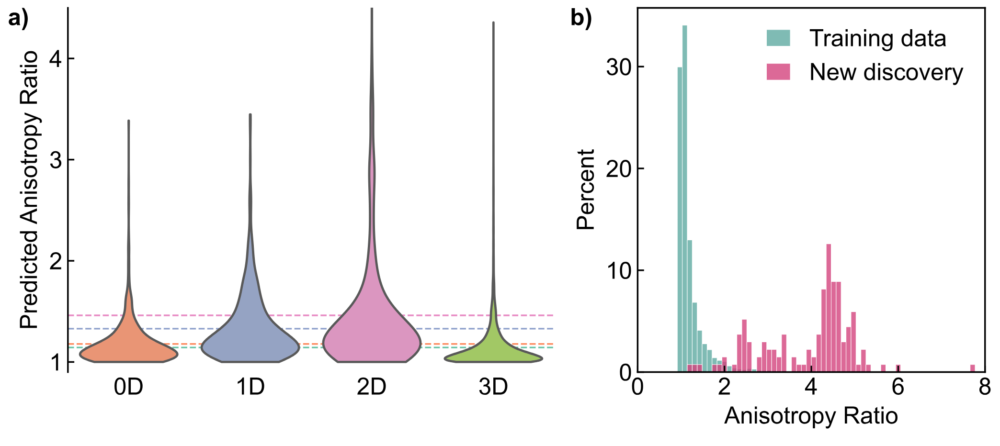

[](http://dx.doi.org/10.5281/zenodo.12734234)

[GitHub](https://github.com/virtualatoms/AnisoNet) | [Paper](https://pubs.rsc.org/en/content/articlehtml/2024/fd/d4fd00096j) | [Trained Model](https://figshare.com/articles/software/anisonet-stock_ckpt/26270974)


AnisoNet is an equivariant graph neural network used to predict the dielectric tensor of crystal materials.

## Installation

First clone the repository using

```
git clone https://github.com/virtualatoms/AnisoNet.git
cd AnisoNet
```

To install with GPU capability, run
```
pip install torch --index-url https://download.pytorch.org/whl/cu121
```

Then to install the packages, run:
```
pip install -e .
```

To train AnisoNet:
```
anisonet-train --name "anisonet" \
               --train_file "dataset/train_dataset.p" \
               --em_dim 48 \
               --layers 2 \
               --lmax 3 \
               --num_basis 15 \
               --mul 48 \
               --lr 0.003 \
               --wd 0.03 \
               --batch_size 12 \
               --max_epoch 120 \
               --enable_progress_bar True
```


## Content of AnisoNet
You can find all source code in `src/anisonet`, all the code to generate the plots used in the paper in `notebooks/plots` and train anisonet from scratch by running `scripts/run_train.sh`. To use AnisoNet to predict dielectric tensors, follow `predict.ipynb` in notebooks. The trained model are hosted on figshare [[https://figshare.com/articles/software/anisonet-stock_ckpt/262709740](https://figshare.com/articles/software/anisonet-stock_ckpt/26270974?file=47625562)].



## Citation
If you use AnisoNet in your work, please cite it as follows:
```
@article{lou_discovery_2025,
  title = {Discovery of Highly Anisotropic Dielectric Crystals with Equivariant Graph Neural Networks},
  author = {Yuchen Lou and Alex M. Ganose},
  year = {2025},
  journaltitle = {Faraday Discussions},
  volume = {256},
  number = {0},
  pages = {255--274},
  publisher = {Royal Society of Chemistry},
  doi = {10.1039/D4FD00096J},
  url = {https://pubs.rsc.org/en/content/articlelanding/2025/fd/d4fd00096j},
}

Lou, Y., & M. Ganose, A. (2025). Discovery of highly anisotropic dielectric crystals with equivariant graph neural networks. Faraday Discussions, 256(0), 255–274. https://doi.org/10.1039/D4FD00096J

```

## Acknowledgements
We thank Jason Munro for help with obtaining the dielectric tensor dataset from the Materials Project. A.M.G. was supported by EPSRC Fellowship EP/T033231/1. We are grateful to the UK Materials and Molecular Modelling Hub for computational resources, which are partially funded by EPSRC (EP/T022213/1, EP/W032260/1 and EP/P020194/1). This project made use of time on the Tier 2 HPC facility JADE, funded by EPSRC (EP/P020275/1).
